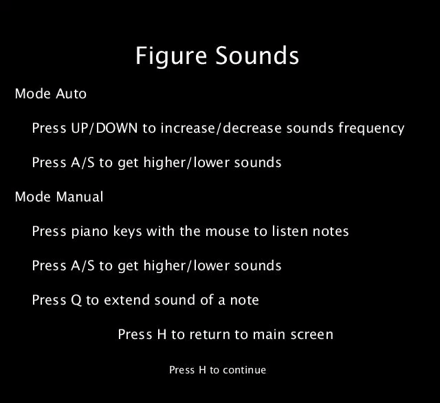

# FigureSounds

## Operating modes

* __Auto__

  - Press UP/DOWN to increase/decrease sounds frequency.
  - Press A/S to get higher/lower sounds

* __Manual__

  - Press piano keys with the mouse to listen notes.
  - Press A/S to get higher/lower sounds
  - Press Q to extend sound of a note
  
Press H to return to main screen

## Referencies

[Repository of examples](https://github.com/otsedom/CIU).
